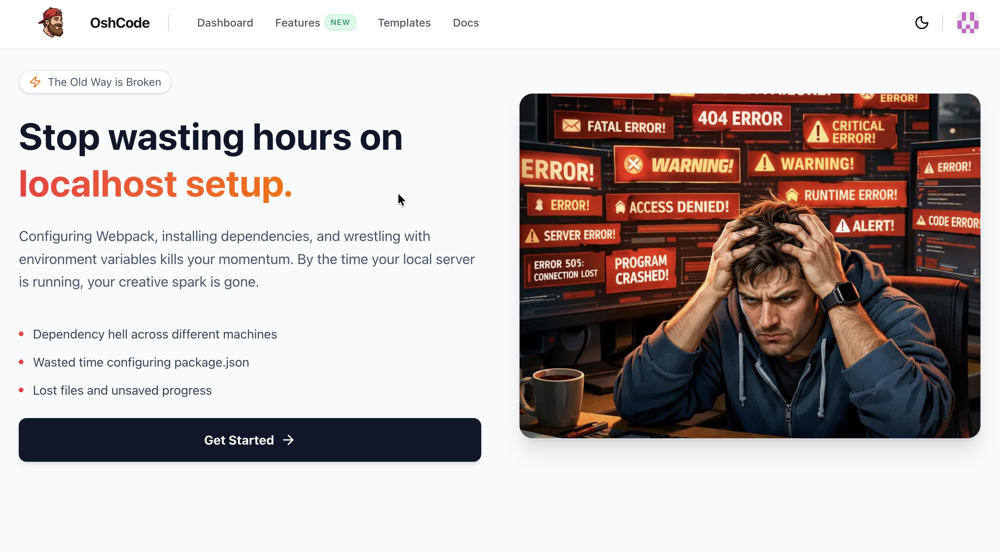
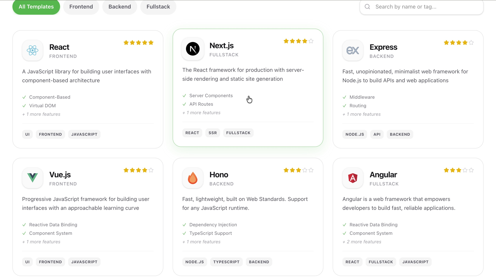
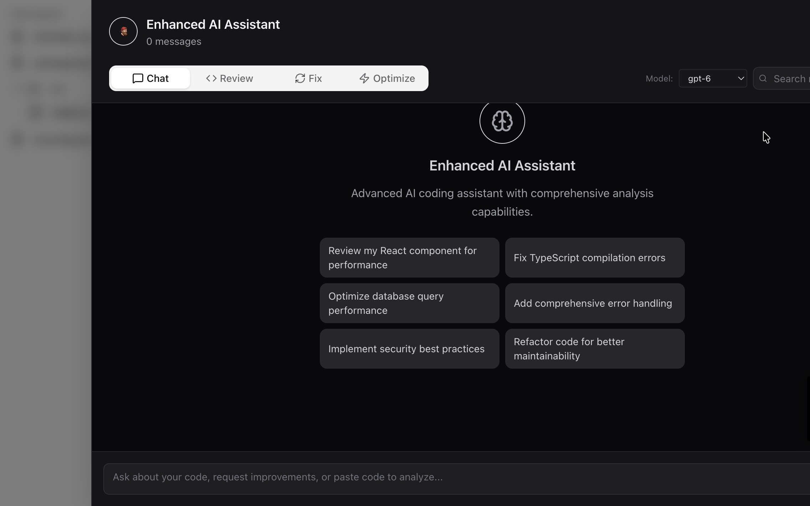
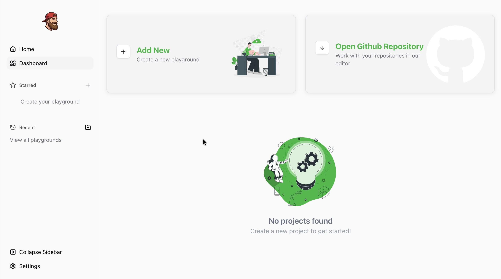

# 🚀 OshCode: Code at the Speed of Thought.

<div align="center">
  
</div>

<div align="center">
  <a href="https://nextjs.org/"></a>
  <a href="https://webcontainers.io/"></a>
  <a href="https://groq.com/"></a>
  <a href="https://vercel.com"></a>
</div>

<br/>

**OshCode** is a fully functional, cloud-native integrated development environment (IDE) that completely eliminates the friction of local setup. By heavily leveraging WebContainers, OshCode boots up full-stack Node.js environments—including React, Next.js, Vue, Express, and Hono—entirely within your browser in under two seconds.

We've all been there: wrestling with Webpack, debugging `package.json` conflicts across different machines, and losing creative momentum to environment variable hell. OshCode solves this by giving you an instant, cloud-native workspace supercharged with blazing-fast AI.

---

## ✨ Core Features

### ⚡ Instant WebContainers
Skip the boilerplate. OshCode acts as a complete operating system in your browser. Boot up production-ready starter templates for modern frameworks without installing a single dependency locally.

<div align="center">
  
</div>

### 🧠 Context-Aware AI Assistant
Built on Groq's lightning-fast inference infrastructure.
* **Inline "Ghost Text" Autocomplete:** Powered by the dedicated `Qwen 2.5 Coder 32B` model. OshCode reads your cursor context and writes highly accurate code directly into the Monaco Editor via strict Fill-In-the-Middle (FIM) generation.
* **Smart AI Chat:** A sliding sidebar powered by Meta's flagship `Llama 3.3 70B Versatile`. Highlight a bug, and the AI will read your active file context to explain the error, refactor the logic, or suggest architectural improvements.

<div align="center">
  
</div>

### 🐙 Seamless GitHub Integration
Bring your own code. Connect your GitHub account via NextAuth and import any repository directly into OshCode. We fetch your file tree, bypass heavy binaries, and load your source code into a secure, high-performance browser container.

### 🛠️ Professional Workspace Control
* **Split-Pane UI:** Built with `shadcn/ui` and `react-resizable-panels` for a fluid, highly customizable layout containing the file explorer, Monaco editor, and live preview.
* **Dashboard Management:** Star your favorites, duplicate/fork workspaces to experiment safely without breaking production, rename projects on the fly, and securely delete old environments.

<div align="center">
  
</div>

---

## 🏗️ Architecture & Tech Stack

OshCode is built using the bleeding edge of the modern web ecosystem, optimized for edge delivery and zero-latency interactions.

**Frontend & UI:**
* **Framework:** Next.js (App Router)
* **Styling:** Tailwind CSS + shadcn/ui components
* **Editor:** Monaco Editor (The underlying engine powering VS Code)
* **State Management:** React Hooks & Zustand

**Backend & Data:**
* **Architecture:** Next.js Server Actions & Server Components
* **Database:** PostgreSQL managed via Prisma ORM
* **Authentication:** NextAuth.js (Seamless GitHub & Google OAuth)
* **File System:** Node `fs/promises` with secure OS `/tmp` handling for serverless environments

**AI & Execution Engine:**
* **Containerization:** WebContainers API by StackBlitz
* **AI Inference:** Groq SDK (Llama & Qwen models running at 800+ tokens/second)

---

## 🚀 Getting Started (Local Development)

Want to run OshCode locally or contribute to the project? Follow these steps to spin up your local cloud environment.

### 1. Clone the repository
```bash
git clone [https://github.com/yourusername/oshcode.git](https://github.com/yourusername/oshcode.git)
cd oshcode

npm install

# Database
DATABASE_URL="your_postgresql_database_url"

# Authentication
NEXTAUTH_SECRET="generate_a_random_secure_string"
NEXTAUTH_URL="http://localhost:3000"

AUTH_GITHUB_ID="your_github_oauth_id"
AUTH_GITHUB_SECRET="your_github_oauth_secret"

AUTH_GOOGLE_ID="your_google_oauth_id"
AUTH_GOOGLE_SECRET="your_google_oauth_secret"

# AI Integration
GROQ_API_KEY="your_groq_api_key"

# Database Setup
npx prisma db push
npx prisma generate

#Run the Development Server
npm run dev
